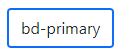
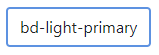
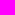
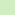

<p align="center">
  <a href="https://getbootstrap.com/">
    
  </a>
</p>

<h3 align="center">Bootstrap + Color 🌈</h3>

<p align="center">
  Bootstrap is a free and open-source CSS framework directed at responsive, mobile-first front-end web development developed by TWITTER.
  <br />
  <a href="https://getbootstrap.com/docs/5.2/"
    ><strong>Explore Bootstrap docs »</strong></a
  >
</p>


## Table of contents

- [Table of contents](#table-of-contents)
- [Quick-Start](#quick-start)
- [What's included](#whats-included)
- [Based Colors](#based-colors)
- [Light Colors](#light-colors)
- [Dark Colors](#dark-colors)
- [Bootstrap 5 Default Colors](#bootstrap-5-default-colors)
- [Extended Colors](#extended-colors)
- [Others Colors](#others-colors)

<h2 align="center">
  Documentation ✍️
 </h2>
 <p align="center">
  Color is a free and open-source CSS which is extends Bootstrap colors.
    <br />
  <a href="https://test-218.gitbook.io/bootstrap-color/"
    ><strong>Explore Bootstrap Color docs »</strong></a
  >
</p>
</h2>

## Quick-Start

- Manually
  Download the `bootstrap.color.min.css` file here. It includes all dependencies. You must have include bootstrap at first.
- CDN
  - Step 1: Link Bootstrap CDN in your head tag
  ```html
  <link
    href="https://cdn.jsdelivr.net/npm/bootstrap@5.0.2/dist/css/bootstrap.min.css"
    rel="stylesheet"
  />
  ```
  - Step 2: Link this CDN (bootstrap.color.min.css)
  ```html
  <link
    href="https://cdn.jsdelivr.net/gh/rayhanalshorif133/bootstrap-color/dist/css@1.0.0/bootstrap.color.min.css"
    rel="stylesheet"
  />
  ```
  - Include Bootstrap’s CSS and JS. Place the <link> tag in the <head> for our CSS, and the <script> tag for our JavaScript bundle (including Popper for positioning dropdowns, poppers, and tooltips) before the closing </body>.
  ```html
  <!DOCTYPE html>
  <html lang="en">
    <head>
      <meta charset="utf-8" />
      <meta name="viewport" content="width=device-width, initial-scale=1" />
      <title>Bootstrap demo</title>
      <link
        href="https://cdn.jsdelivr.net/npm/bootstrap@5.2.0/dist/css/bootstrap.min.css"
        rel="stylesheet"
      />
      <link
        href="https://cdn.jsdelivr.net/gh/rayhanalshorif133/bootstrap-color/dist/css@1.0.0/bootstrap.color.min.css"
        rel="stylesheet"
      />
    </head>
    <body>
      <h1>Hello, world!</h1>
      <script src="https://cdn.jsdelivr.net/npm/bootstrap@5.2.0/dist/js/bootstrap.bundle.min.js"></script>
      <script src="https://cdn.jsdelivr.net/npm/@popperjs/core@2.11.5/dist/umd/popper.min.js"></script>
      <script src="https://cdn.jsdelivr.net/npm/bootstrap@5.2.0/dist/js/bootstrap.min.js"></script>
    </body>
  </html>
  ```

## What's included

We are providing many other classes as color property.

## Based Colors

- text-"color-name" :star: Which is provided `Text Color` Example: `text-primary`

  - 

```html
<span class="text-primary"> text-primary </span>
```

- bg-"color-name" :star: Which is provided `Background Color` Example: bg-primary

  - 

```html
<span class="bg-primary"> bg-primary </span>
```

- bd-"color-name" :star: Which is provided `Border Color` Example: bd-primary

  - 

```html
<span class="bd-primary"> bd-primary </span>
```

- btn-"color-name" :star: Which is provided `Button Color` Example: btn-primary

  - 

```html
<span class="btn-primary"> btn-primary </span>
```

- btn-outline-"color-name" :star: Which is provided `Button Outline Color with Hover Effect` Example: btn-outline-primary

  -  

```html
<span class="btn-outline-primary"> btn-outline-primary </span>
```

## Light Colors

- text-"color-light-name" :star: Which is provided `Text's Light Color` Example: `text-light-primary`

  - 

```html
<span class="text-light-primary"> text-light-primary </span>
```

- bg-"color-light-name" :star: Which is provided `Text's Light Background Color` Example: bg-light-primary

  - 

```html
<span class="bg-light-primary"> bg-light-primary </span>
```

- bd-"color-name" :star: Which is provided `Border Color` Example: bd-primary

  - 

```html
<span class="bd-light-primary"> bd-light-primary </span>
```

- btn-light-"color-name" :star: Which is provided `Button Color` Example: btn-light-primary

  - 

```html
<span class="btn-light-primary"> btn-light-primary </span>
```

- btn-outline-light-"color-name" :star: Which is provided `Button Outline light Color with Hover Effect` Example: btn-outline-light-primary

  -  

```html
<span class="btn-outline-light-primary"> btn-outline-light-primary </span>
```

## Dark Colors

- text-dark"color-name" :star: Which is provided `Text's Dark Color` Example: `text-dark-primary`

  - 

```html
<span class="text-dark-primary"> text-dark-primary </span>
```

- bg-dark-"color-name" :star: Which is provided `Background Dark Color` Example: bg-dark-primary

  - 

```html
<span class="bg-dark-primary"> bg-dark-primary </span>
```

- bd-dark-"color-name" :star: Which is provided `Border Dark Color` Example: bd-dark-primary

  - 

```html
<span class="bd-dark-primary"> bd-dark-primary </span>
```

- btn-dark-"color-name" :star: Which is provided `Button Dark Color` Example: btn-dark-primary

  - 

```html
<span class="btn-dark-primary"> btn-dark-primary </span>
```

- btn-outline-dark-"color-name" :star: Which is provided `Button Outline Dark Color with Hover Effect` Example: btn-outline-dark-primary

  -  

```html
<span class="btn-outline-dark-primary"> btn-outline-dark-primary </span>
``` 

## Bootstrap 5 Default Colors

-  `primary`  `secondary`  `success`  `white`  `light`  `muted`  `dark` `info` `link` `warning` `danger`


## Extended Colors

-  `ruby` -  `pink` -  `fuchsia-pink` -  `mulberry` -  `hot` -  `french` -  `cerise` -  `punch` -  `rose` -  `pale-rose` -  `lemonade` -  `magenta` -  `thulian` -  `fuchsla` -  `brick` -  `ultra` -  `amaranth` -  `bubble-gum` -  `flamingo` -  `carnation` -  `taffy` -  `creamy` -  `violet` -  `mulberry` -  `hibiscus` -  `plum` -  `grape` -  `amethyst` -  `eggplant` -  `orchid` -  `lollipop` -  `lavender` -  `fandango` -  `african` -  `helio` -  `mauve` -  `floral` -  `royal` -  `byzantine` -  `thistle` -  `electric` -  `gray` -  `fossil` -  `shadow` -  `steel` -  `stone` -  `ash` -  `harbor` -  `anchor` -  `abalone` -  `pearl` -  `pewter` -  `rhino` -  `mink` -  `trout` -  `lava` -  `charcoal` -  `iron` -  `seal` -  `thunder` -  `smoke` -  `green` -  `yellow-green` -  `forest` -  `emerald` -  `jungle` -  `laurel` -  `kelly` -  `hunter` -  `sacramento` -  `lime` -  `olive` -  `fern` -  `mint` -  `sage` -  `pine` -  `army` -  `sea` -  `moss` -  `tea` -  `artichoke` -  `jade` -  `orange` -  `gold` -  `clay` -  `tiger` -  `honey` -  `rust` -  `ochre` -  `amber` -  `fire` -  `pumpkin` -  `tangerine` -  `amber-chocolate` -  `chocolate` -  `goldenrod` -  `apricot` -  `cider` -  `carrot` 


-  `bronze` -  `dijon` -  `burnt` -  `red` -  `salmon` -  `burgundy` -  `redwood` -  `raspberry` -  `crimson` -  `indian` -  `sangria` -  `imperial` -  `barn` -  `maroon` -  `ferrari` -  `scarlet` -  `persian` -  `carmine` -  `mahogany` -  `apple` -  `usa-flg` -  `fire-brick` -  `chili` -  `yellow` -  `lemon` -  `banana` -  `corn` -  `mellow` -  `bumblebee` -  `yellow-royal` -  `trombone` -  `tuscany` -  `mustard` -  `laguna` -  `peach` -  `flaxen` -  `ecru` -  `cream` -  `sepia` -  `cyber` -  `flax` -  `pineapple` -  `blue` -  `yale` -  `egyptian` -  `carolina` -  `turkish` -  `denim` -  `air-force` -  `prussian` -  `independence` -  `sky` -  `steel-blue` -  `cornflower` -  `pigeon` -  `olympic` -  `azure` -  `space` -  `maya` -  `sapphire` -  `navy` -  `baby` -  `blue` -  `yale` -  `egyptian` -  `carolina` -  `turkish` -  `denim` -  `air-force` -  `prussian` -  `independence` -  `sky` -  `steel-blue` -  `cornflower` -  `pigeon` -  `olympic` -  `azure` -  `space` -  `maya` -  `sapphire` -  `navy` -  `prussian-blue` -  `french-blue` -  `turquoise-blue` -  `baby` -  `brown` -  `cedar` -  `peanut` -  `bread` -  `caramel` -  `tawny` -  `umber` -  `coffee` -  `mocha` -  `brunette` -  `syrup` -  `pecan` -  `cinnamon` -  `wood` -  `espresso` -  `russet` -  `walnut` -  `hickory` -  `tortilla`
- 

## Others Colors

-  `transparent` 
